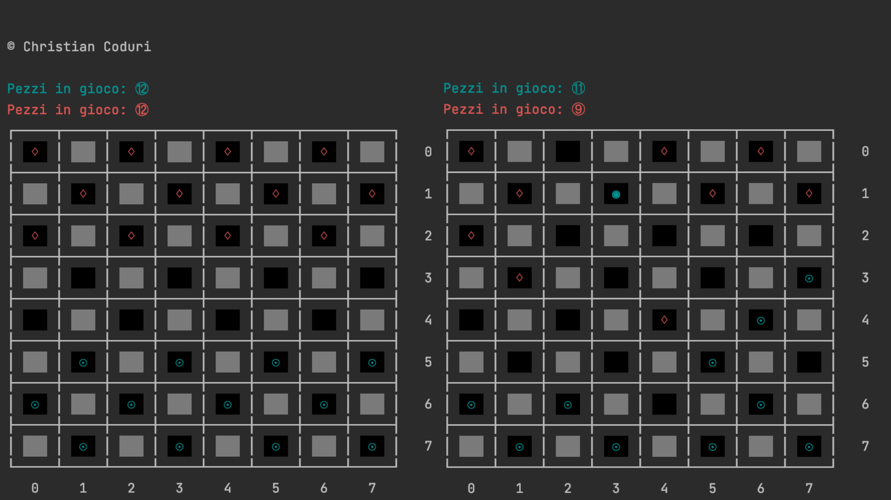
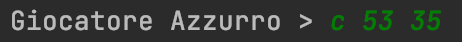
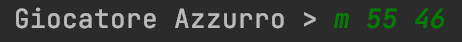

# JDama

### Giocatore 1:
    ♢ Pedina
    ♦ Dama

### Giocatore 2:
    ☉ Pedina
    ◉ Dama

## Schermata di gioco:
Dalla console è possibile visualizzare la schermata di gioco, che viene stampata ad ogni mossa, da questa è possibile vedere la disposizione delle pedine, e attraverso un contatore è sempre possibile sapere quale dei due giocatori sta avendo la meglio.
    

### Formato input:
    L'input della mossa deve essere effetuato con un formato di questo tipo:
    
 

- Dove 'c' ed 'm' indicano il tipo di mossa che si vuole fare: cattura o movimento
- I due numeri che seguono indicano rispettivamente la posizione di partenza e la posizione di arrivo, più precisamente:
    - la prima cifra indica la riga
    - la seconda indica la colonna.
